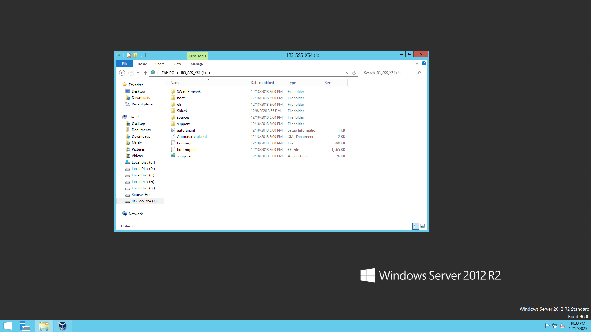

### PART 1.

1. The most popular hypervisors for infrastructure virtualization are following:
      - Microsoft Hyper-V; 
      - VMware vSphere Hypervisor; 
      - Oracle VirtualBox;
      - Citrix XenServer.

2. Type 1 hypervisors are hypervisors which run directly on the physical hardware    of the host machine. 
   Due to this fact, this type of hypervisors is considered the most effective. 
   It is also considered the most efficient for corporate computing.
   Such popular hypervisors, as Microsoft Hyper-V, VMware vSphere Hypervisor, Citrix XenServer are type 1 hypervisors.
      
   Oracle VirtualBox are type 2 hypervisors, unlike  the first type,  are usually installed on an existing operating system. 
   This makes them hosted hypervisors because they use the host's OS to perform certain operations, 
   such as managing calls to the CPU, managing network resources, and managing memory and storage. 
   This allows Type 2 hypervisors  to support a wide variety of hardware.


### PART 2. VirtualBox


   Ubuntu Desktop was installed to Oracle VirtualBox hypervisor and called "Ubuntu_20.10_Orlov".
   Virtual machine settings:
   
.png)

.png)

.png)

.png)

.png)

.png)

.png)

.png)

.png)

.png)
   
   VM "Ubuntu_20.10_Orlov" was cloned and was created a VM "Ubuntu_20.10_Orlov_Clone".

.png)

.png)

.png)

Two VMs were added to the group and the commands for working with them were learned.


VM "Ubuntu_20.10_Orlov" took several pictures of the system.

.png)

VM "Ubuntu_20.10_Orlov" was exported to "Ubuntu_20.10_Orlov.ova" and imported as a new VM.

.png)

.png)

.png)

.png)

The USB port was installed for connection to the virtual machine and configured a shared folder for data exchange between the virtual machine and the host.




.png)

The network was set up by two virtual machines.

.png)

Virtual machine management via Vboxmanage list.
    
```csharp
c:\Program Files\Oracle\VirtualBox>vboxmanage createvm --name CentOS/7 --ostype
RedHat_64 --register
Virtual machine 'CentOS/7' is created and registered.
UUID: a69c26c6-0418-4919-94cf-78db5d76c82b
Settings file: 'C:\Users\Administrator\VirtualBox VMs\CentOS_7\CentOS_7.vbox'

c:\Program Files\Oracle\VirtualBox>vboxmanage showvminfo CentOS/7
Name:                        CentOS/7
Groups:                      /
Guest OS:                    Red Hat (64-bit)
UUID:                        a69c26c6-0418-4919-94cf-78db5d76c82b
Config file:                 C:\Users\Administrator\VirtualBox VMs\CentOS_7\Cent
OS_7.vbox
Snapshot folder:             C:\Users\Administrator\VirtualBox VMs\CentOS_7\Snap
shots
Log folder:                  C:\Users\Administrator\VirtualBox VMs\CentOS_7\Logs

Hardware UUID:               a69c26c6-0418-4919-94cf-78db5d76c82b
Memory size                  128MB
Page Fusion:                 disabled
VRAM size:                   8MB
CPU exec cap:                100%
HPET:                        disabled
CPUProfile:                  host
Chipset:                     piix3
Firmware:                    BIOS
Number of CPUs:              1
PAE:                         enabled
Long Mode:                   enabled
Triple Fault Reset:          disabled
APIC:                        enabled
X2APIC:                      enabled
Nested VT-x/AMD-V:           disabled
CPUID Portability Level:     0
CPUID overrides:             None
Boot menu mode:              message and menu
Boot Device 1:               Floppy
Boot Device 2:               DVD
Boot Device 3:               HardDisk
Boot Device 4:               Not Assigned
ACPI:                        enabled
IOAPIC:                      enabled
BIOS APIC mode:              APIC
Time offset:                 0ms
RTC:                         local time
Hardware Virtualization:     enabled
Nested Paging:               enabled
Large Pages:                 enabled
VT-x VPID:                   enabled
VT-x Unrestricted Exec.:     enabled
Paravirt. Provider:          Default
Effective Paravirt. Prov.:   KVM
State:                       powered off (since 2020-12-17T16:08:02.905000000)
Graphics Controller:         VBoxVGA
Monitor count:               1
3D Acceleration:             disabled
2D Video Acceleration:       disabled
Teleporter Enabled:          disabled
Teleporter Port:             0
Teleporter Address:
Teleporter Password:
Tracing Enabled:             disabled
Allow Tracing to Access VM:  disabled
Tracing Configuration:
Autostart Enabled:           disabled
Autostart Delay:             0
Default Frontend:
VM process priority:         default
NIC 1:                       MAC: 080027A2364C, Attachment: NAT, Cable connected
: on, Trace: off (file: none), Type: 82540EM, Reported speed: 0 Mbps, Boot prior
ity: 0, Promisc Policy: deny, Bandwidth group: none
NIC 1 Settings:  MTU: 0, Socket (send: 64, receive: 64), TCP Window (send:64, re
ceive: 64)
NIC 2:                       disabled
NIC 3:                       disabled
NIC 4:                       disabled
NIC 5:                       disabled
NIC 6:                       disabled
NIC 7:                       disabled
NIC 8:                       disabled
Pointing Device:             PS/2 Mouse
Keyboard Device:             PS/2 Keyboard
UART 1:                      disabled
UART 2:                      disabled
UART 3:                      disabled
UART 4:                      disabled
LPT 1:                       disabled
LPT 2:                       disabled
Audio:                       enabled (Driver: DSOUND, Controller: AC97, Codec: S
TAC9700)
Audio playback:              disabled
Audio capture:               disabled
Clipboard Mode:              disabled
Drag and drop Mode:          disabled
VRDE:                        disabled
OHCI USB:                    disabled
EHCI USB:                    disabled
xHCI USB:                    disabled

USB Device Filters:

<none>

Bandwidth groups:  <none>

Shared folders:<none>

Capturing:                   not active
Capture audio:               not active
Capture screens:
Capture file:                C:\Users\Administrator\VirtualBox VMs\CentOS_7\Cent
OS_7.webm
Capture dimensions:          1024x768
Capture rate:                512kbps
Capture FPS:                 25kbps
Capture options:

Guest:

Configured memory balloon size: 0MB
```

.png)

.png)

.png)

.png)


### PART 3. Vagrant

1.  Create a folder "orlov_yevhenii".

.png)

2. Initialize environment with Vagrant by default and start it.

.png)

3. Connected  to  the  VM  using  the  program  PuTTY.

.png)

4. Stopped the VM.
 
.png)

5. Deleted the VM.

.png)

6. Initialize environment with Vagrant by Ubuntu and start it.

.png)

7. Initialize environment with Vagrant by CentOS/7 and start it.

.png)
