### Module 4 NetworkingFundamentals
#### TASK 4.1

#### Topology 1

1.  The project was assembled. I used 4 computers and 1 Hub.

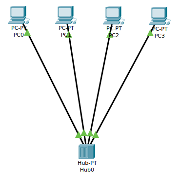

2. Computers have been assigned static IP addresses.

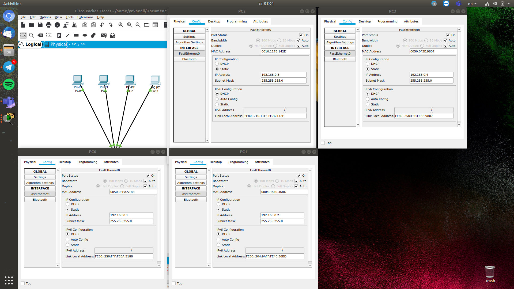

3. Network package analysis performed.

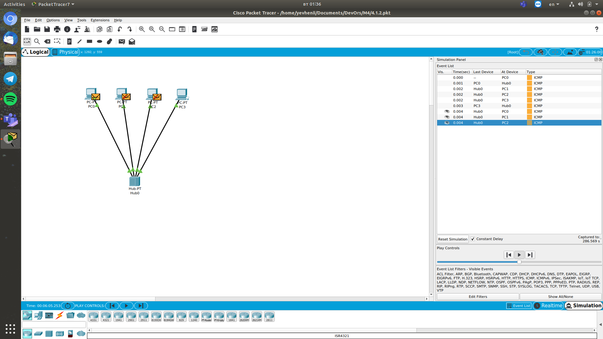

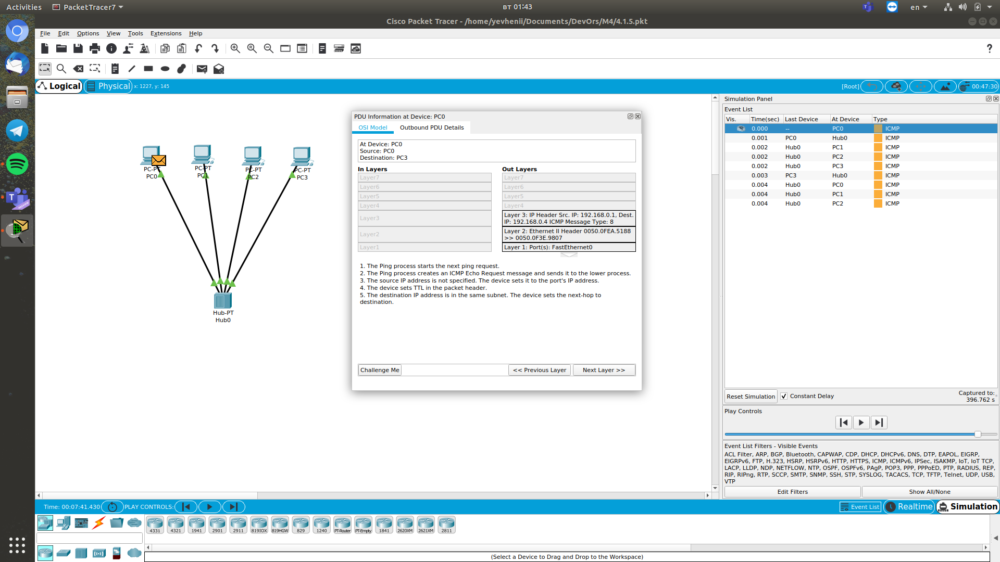

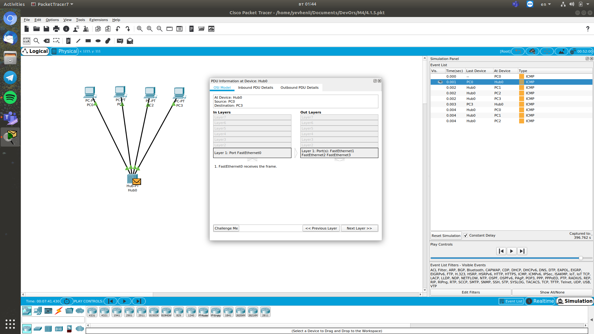

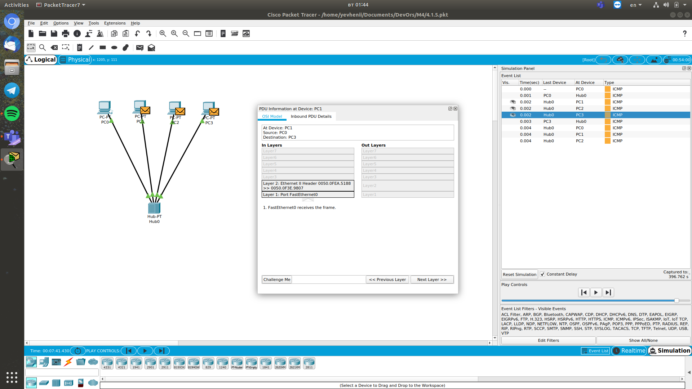

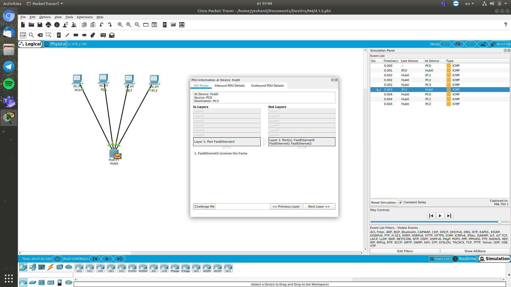

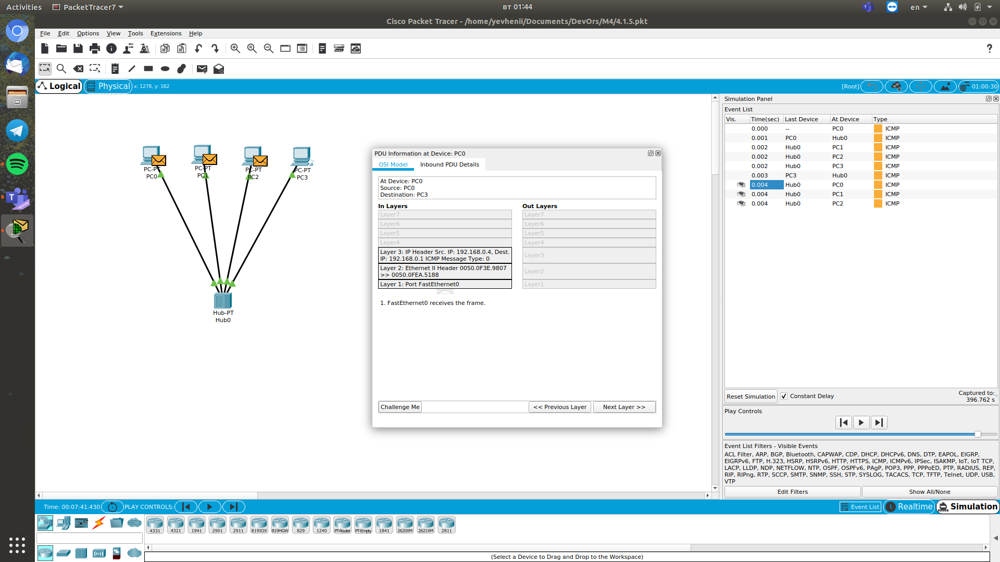

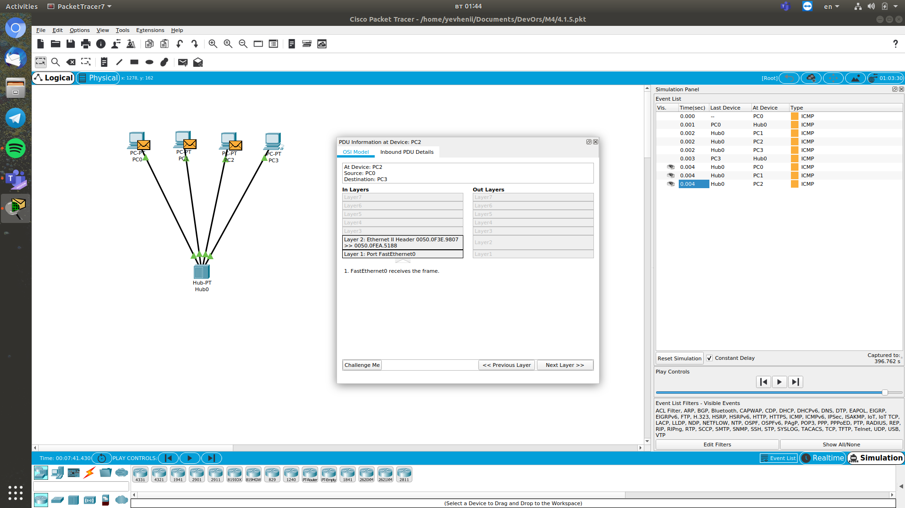

#### Topology 2
1. The project was assembled. I used 6 computers, 2 Hubs and 1 Server.

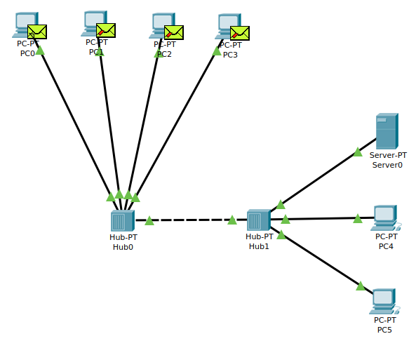

2. Analysis performed similar to the first scheme.

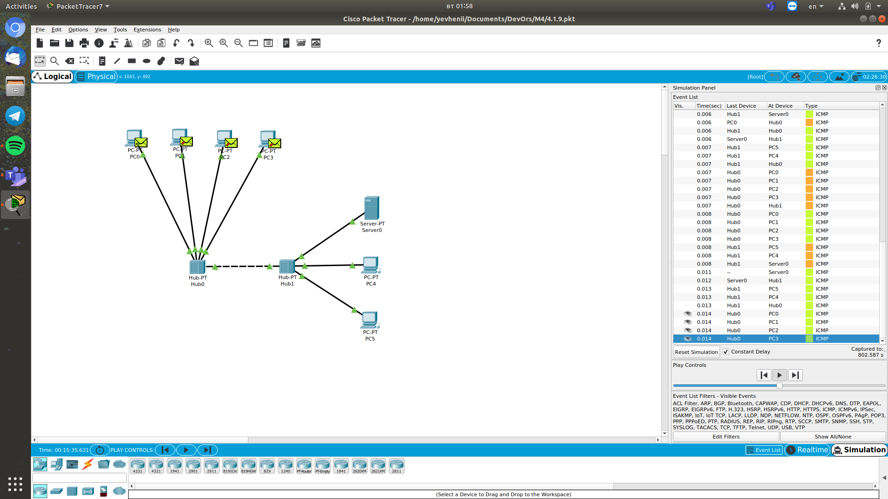

#### Topology 3
1. The project was assembled. I used 4 computers and 1 switch.

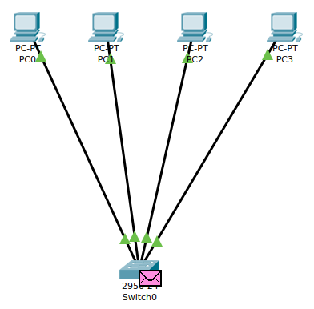

2. Analysis performed similar to previous schemes.

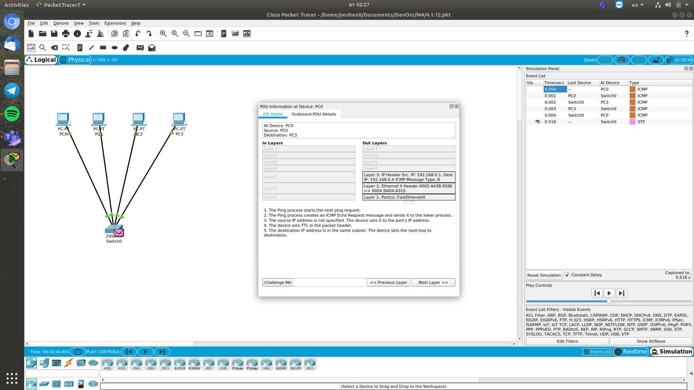

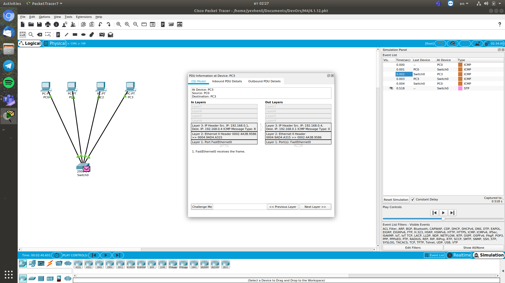

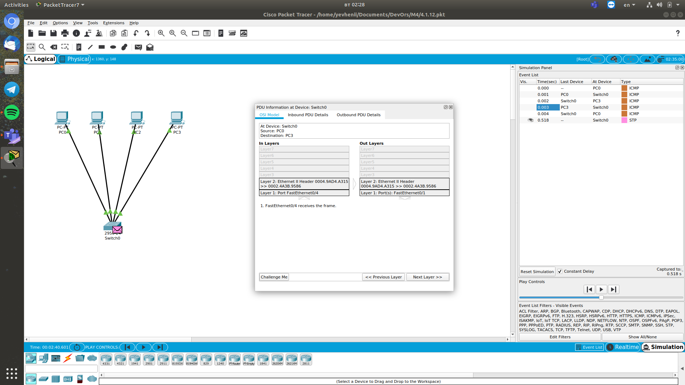

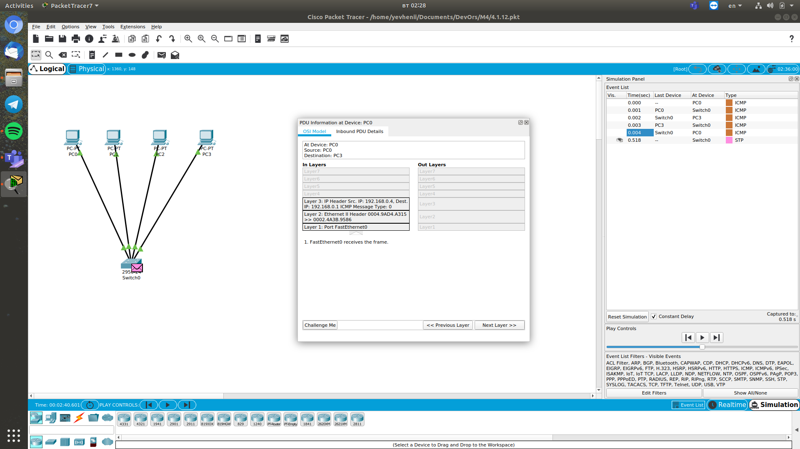

#### Topology 4
1. The project was assembled. I used 8 computers, 2 switchs and 1 router.

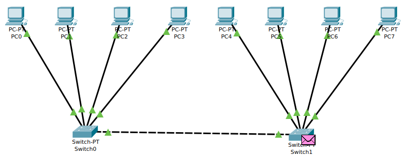

2. Analysis performed similar to previous schemes.

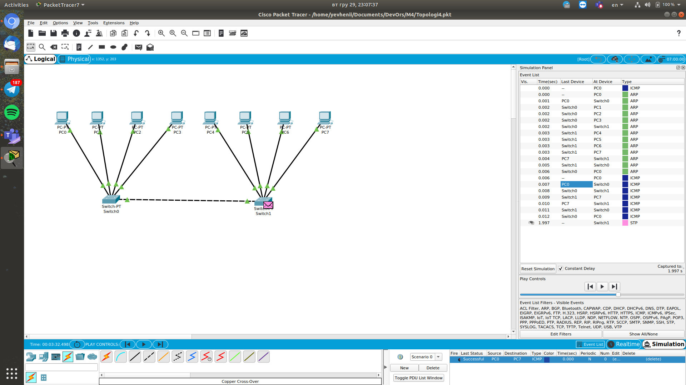

#### Topology 5
1. The project was assembled. I used 4 computers and 1 switch.

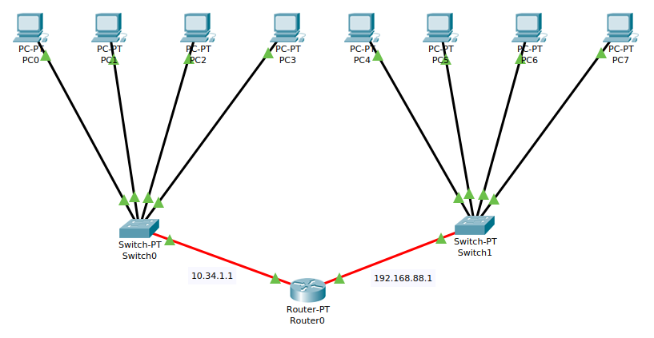

2. Analysis performed similar to previous schemes.

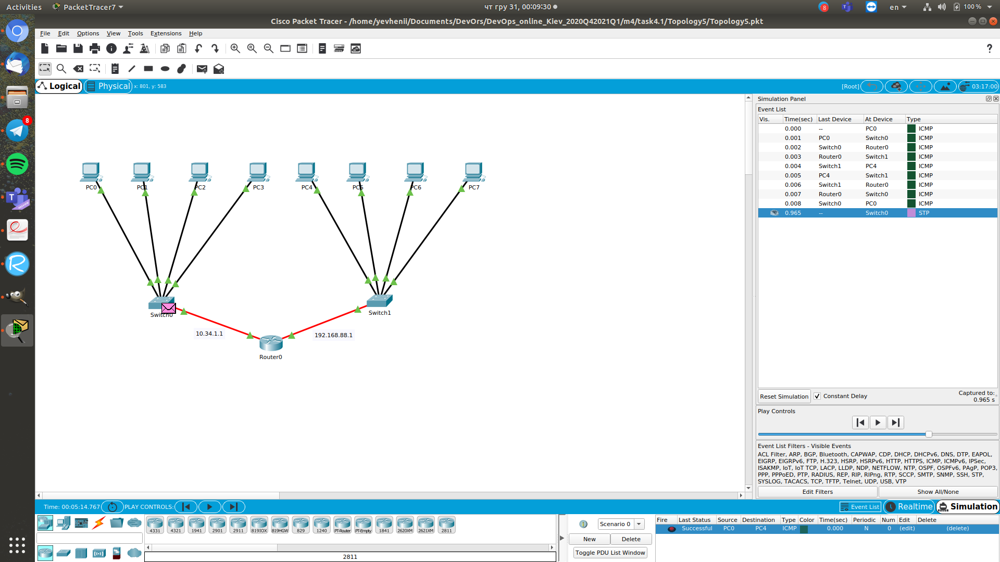

3. I've compared betwen topology 4 and topology 5.
According to the calculations, the delivery time of the packets to topology 4 is 0,077 sec. The delivery time of the packets to topology 5 is 0,036 sec. This suggests that the use of the router agent is more effective than without.
