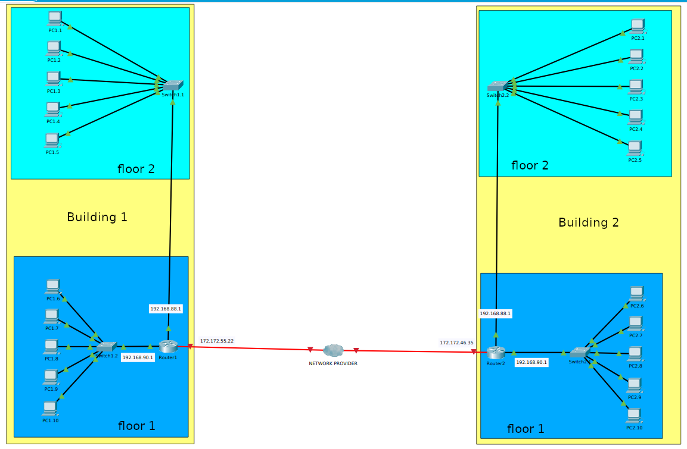
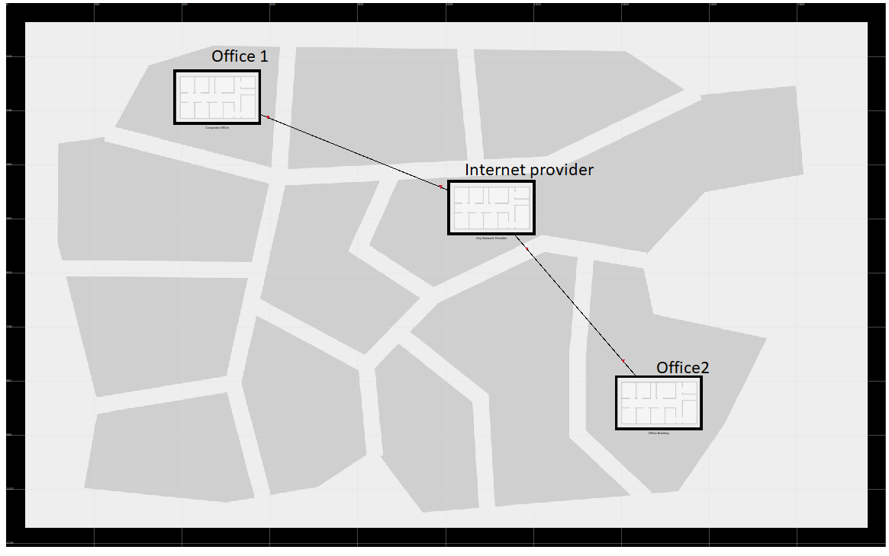
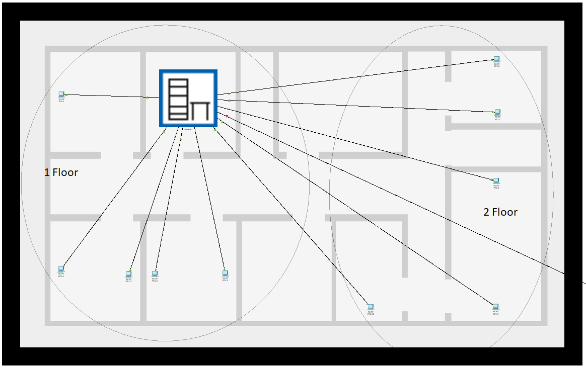
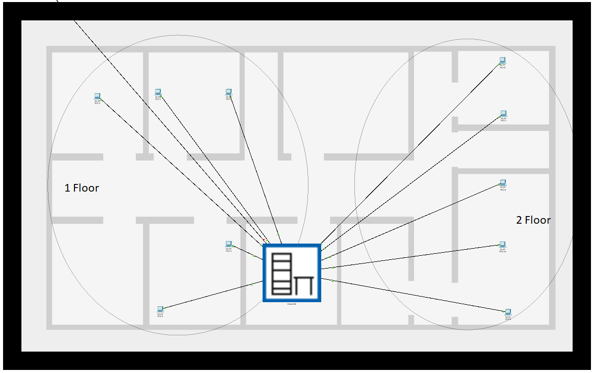

### Module 4 NetworkingFundamentals
#### TASK 4.2.1

1.  The corporate network of the organization was created.
Logical view:

Fysical view:
 - City
 

 - First Building
 

- Second Building

2. 