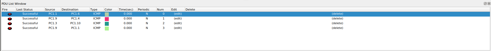
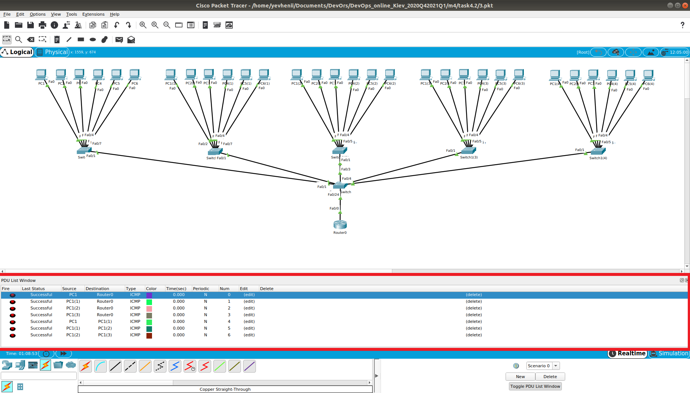

### Module 4 NetworkingFundamentals
#### TASK 4.2.1

1.  The corporate network of the organization was created.

Logical view:

Fysical view:
 - City
 

 - First Building
 

- Second Building

2. I analyzed the network and checked the delivery of the packages.

#### TASK 4.2.2

1. The corporate network of the organization was created.

I've used 8 sub-networks:

| PC		|	Network			|
|-----------	|	:-------------------:	|
|	1.1	|	192.168.1.2/24	|
|	1.2	|	192.168.1.3/24	|
|	1.3	|	192.168.1.4/24	|
|	1.4	|	192.168.1.5/24	|
|	1.5	|	192.168.1.6/24	|
|	1.6	|	192.168.1.7/24	|
|	1.7	|	192.168.1.8/24	|
|	1.8	|	192.168.1.9/24	|
|	2.1	|	192.168.2.2/24	|
|	2.2	|	192.168.2.3/24	|
|	2.3	|	192.168.2.4/24	|
|	2.4	|	192.168.2.5/24	|
|	2.5	|	192.168.2.6/24	|
|	2.6	|	192.168.2.7/24	|
|	2.7	|	192.168.2.8/24	|
|	2.8	|	192.168.2.9/24	|
|	3.1	|	192.168.3.2/24	|
|	3.2	|	192.168.3.3/24	|
|	3.3	|	192.168.3.4/24	|
|	3.4	|	192.168.3.5/24	|
|	3.5	|	192.168.3.6/24	|
|	3.6	|	192.168.3.7/24	|
|	3.7	|	192.168.3.8/24	|
|	3.8	|	192.168.3.9/24	|
|	4.1	|	192.168.4.2/24	|
|	4.2	|	192.168.4.3/24	|
|	4.3	|	192.168.4.4/24	|
|	4.4	|	192.168.4.5/24	|
|	4.5	|	192.168.4.6/24	|
|	4.6	|	192.168.4.7/24	|
|	4.7	|	192.168.4.8/24	|
|	4.8	|	192.168.4.9/24	|
|	5.1	|	192.168.5.2/24	|
|	5.2	|	192.168.5.3/24	|
|	5.3	|	192.168.5.4/24	|
|	5.4	|	192.168.5.5/24	|
|	5.5	|	192.168.5.6/24	|
|	5.6	|	192.168.5.7/24	|
|	5.7	|	192.168.5.8/24	|
|	5.8	|	192.168.5.9/24	|
|	6.1	|	192.168.6.2/24	|
|	6.2	|	192.168.6.3/24	|
|	6.3	|	192.168.6.4/24	|
|	6.4	|	192.168.6.5/24	|
|	6.5	|	192.168.6.6/24	|
|	6.6	|	192.168.6.7/24	|
|	6.7	|	192.168.6.8/24	|
|	6.8	|	192.168.6.9/24	|
|	7.1	|	192.168.7.2/24	|
|	7.2	|	192.168.7.3/24	|
|	7.3	|	192.168.7.4/24	|
|	7.4	|	192.168.7.5/24	|
|	7.5	|	192.168.7.6/24	|
|	7.6	|	192.168.7.7/24	|
|	7.7	|	192.168.7.8/24	|
|	7.8	|	192.168.7.9/24	|
|	8.1	|	192.168.8.2/24	|
|	8.2	|	192.168.8.3/24	|
|	8.3	|	192.168.8.4/24	|
|	8.4	|	192.168.8.5/24	|
|	8.5	|	192.168.8.6/24	|
|	8.6	|	192.168.8.7/24	|
|	8.7	|	192.168.8.8/24	|
|	8.8	|	192.168.8.9/24	|

2. I analyzed the network and checked the delivery of the packages.

#### TASK 4.2.3

1. Local network of the complex of 5 one-story buildings.

Logical view:

I’ve divided the network into five subnets:

|	PC		|	Network	|
|	-------------------		|	:-------------------:	|
|	1		|	192.168.1.2/28	|
|	2		|	192.168.1.3/28	|
|	3		|	192.168.1.4/28	|
|	4		|	192.168.1.5/28	|
|	5		|	192.168.1.6/28	|
|	6		|	192.168.1.7/28	|
|	1(1)		|	192.168.1.17/28	|
|	2(1)		|	192.168.1.18/28	|
|	3(1)		|	192.168.1.19/28	|
|	4(1)		|	192.168.1.20/28	|
|	5(1)		|	192.168.1.21/28	|
|	6(1)		|	192.168.1.22/28	|
|	1(2)		|	192.168.1.33/28	|
|	2(2)		|	192.168.1.34/28	|
|	3(2)		|	192.168.1.35/28	|
|	4(2)		|	192.168.1.36/28	|
|	5(2)		|	192.168.1.37/28	|
|	6(2)		|	192.168.1.38/28	|
|	1(3)		|	192.168.1.49/28	|
|	2(3)		|	192.168.1.50/28	|
|	3(3)		|	192.168.1.51/28	|
|	4(3)		|	192.168.1.52/28	|
|	5(3)		|	192.168.1.53/28	|
|	6(3)		|	192.168.1.54/28	|
|	1(4)		|	192.168.1.65/28	|
|	2(4)		|	192.168.1.66/28	|
|	3(4)		|	192.168.1.67/28	|
|	4(4)		|	192.168.1.68/28	|
|	5(4)		|	192.168.1.69/28	|
|	6(4)		|	192.168.1.70/28	|

2. I analyzed the network and checked the delivery of the packages.

