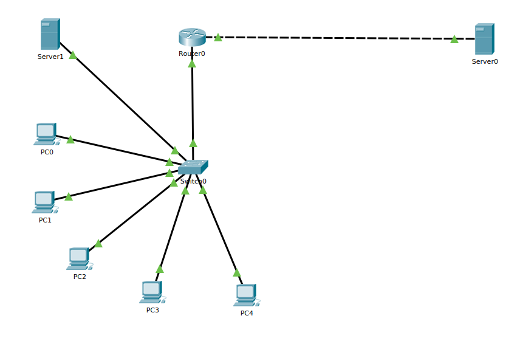
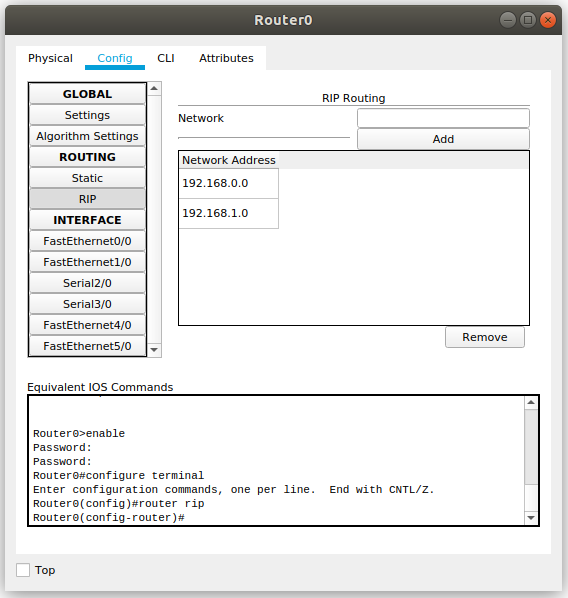
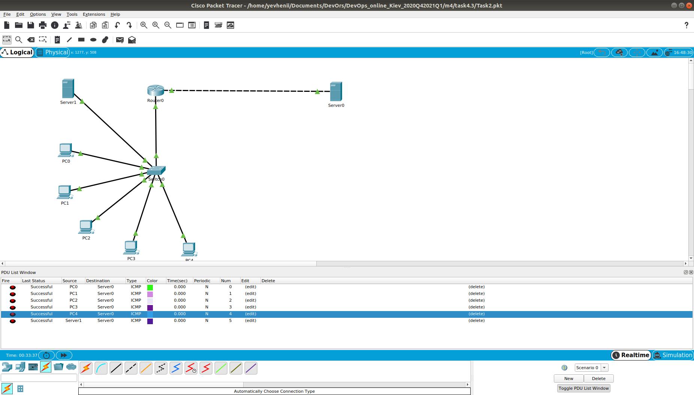

### Module 4 NetworkingFundamentals
#### TASK 4.3

1.  According to the assignment, a local network with 5 computers and 2 servers was created.

2. Hosts and router addresses configured. RIP routing was set up.

3. Successful packet routing is presented in the screen below.

