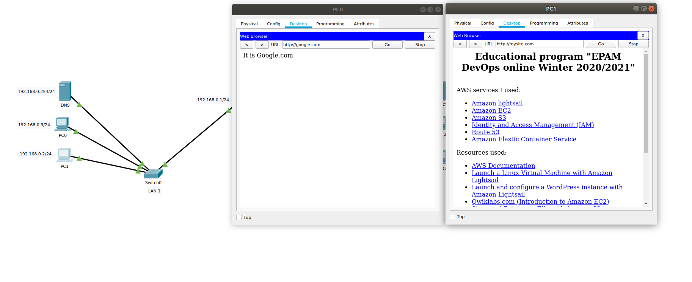

### Module 4 NetworkingFundamentals
#### TASK 4.4.1

1.  I took the topology from the 4.3 assignment and added a second router

2. Router's configurations.

 
 
 
 
 
 
 3.  After the network has been configured, I tested the packet transfer over the networks.
 
 
  
 
   
 
 
 
  
#### TASK 4.4.2

1. According to the task, the network topology was created and configured as in the previous task.

 
 
 2. DNS Servers were configured.
 
  
 
 3. Domain names were configured on DNS servers.
 
 
 
 4. WEB pages were edited on DNS servers.
 
 
 
 5. After fully configuring the DNS servers, I checked the access of all hosts in the network.
 
 
 
 6. I checked the access of Web pages in both networks.
 
 
 
 