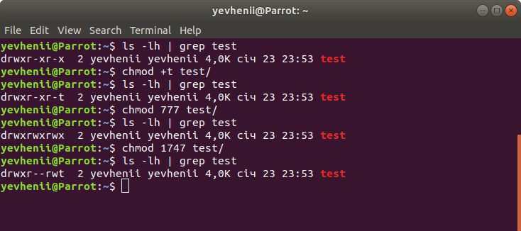

### Module 5 Linux Essentials
#### TASK 5.2

1.1 The structure of the /etc/passwd.

/etc/passwd file stores essential information, which required during login. In other words, it stores user account information. The /etc/passwd is a plain text file. It contains a list of the system’s accounts, giving for each account some useful information like user ID, group ID, home directory, shell, and more. The /etc/passwd file should have general read permission as many command utilities use it to map user IDs to user names. However, write access to the /etc/passwd must only limit for the superuser/root account.

 

/etc/passwd Format

	- Username: It is used when user logs in. It should be between 1 and 32 characters in length.

	- Password: An x character indicates that encrypted password is stored in /etc/shadow file. Please note that you need to use the passwd command to computes the hash of a password typed at the CLI or to store/update the hash of the password in /etc/shadow file.

	- User ID (UID): Each user must be assigned a user ID (UID). UID 0 (zero) is reserved for root and UIDs 1-99 are reserved for other predefined accounts. Further UID 100-999 are reserved by system for administrative and system accounts/groups.

	- Group ID (GID): The primary group ID (stored in /etc/group file)

	- User ID Info: The comment field. It allow you to add extra information about the users such as user’s full name, phone number etc. This field use by finger command.

	- Home directory: The absolute path to the directory the user will be in when they log in. If this directory does not exists then users directory becomes /

	- Command/shell: The absolute path of a command or shell (/bin/bash). Typically, this is a shell. Please note that it does not have to be a shell. For example, sysadmin can use the nologin shell, which acts as a replacement shell for the user accounts. If shell set to /sbin/nologin and the user tries to log in to the Linux system directly, the /sbin/nologin shell closes the connection.

The list of users in the system:

The users have ‘nologin’ at the end of their line. This means that these users cannot login to the system. These users are referred as pseudo-users.

Generally, a normal user has UID greater or equal to 1000. This means the user with UID >=1000 is a normal user and users with UID less than 1000 are system users.

1.2 The structure of the /etc/group.

/etc/group is a text file which defines the groups to which users belong under Linux and UNIX operating system. Under Unix / Linux multiple users can be categorized into groups. Unix file system permissions are organized into three classes, user, group, and others.

/etc/group Format

	- Group: It is the name of group. If you run ls -l command, you will see this name printed in the group field.
	
	- Password: Generally password is not used, hence it is empty/blank. It can store encrypted password. This is useful to implement privileged groups.
	
	- Group ID (GID): Each user must be assigned a group ID. You can see this number in your / etc/ passwd file.
	
	- Group List: It is a list of user names of users who are members of the group. The user names, must be separated by commas.

2. What are the uid ranges? What is UID? How to define it?

A UID (user identifier) is a number assigned by Linux to each user on the system. This number is used to identify the user to the system and to determine which system resources the user can access.

This can be found by the UID stored in the / etc / passwd file. This is the same file that can be used to list all the users in a Linux system.

Most Linux distributions reserve UIDs 1-500 for system users. On Ubuntu and Fedora, the UID for new users starts at 1000.

	- UID 0 (zero) is reserved for the root.
	
	- UIDs 1–99 are reserved for other predefined accounts.
	
	- UID 100–999 are reserved by system for administrative and   system accounts/groups.
	
	- UID 1000–10000 are occupied by applications account.
	
	- UID 10000+ are used for user accounts.

3. What is GID? How to define it?

A group identifier, often abbreviated to GID, is a numeric value used to represent a specific group. The range of values for a GID varies amongst different systems; at the very least, a GID can be between 0 and 32,767, with one restriction: the login group for the superuser must have GID 0. This numeric value is used to refer to groups in the /etc/passwd and /etc/group files or their equivalents. 

Groups in Linux are defined by GIDs (group IDs).

	- GID 0 (zero) is reserved for the root group.
	- GID 1–99 are reserved for the system and application use.
	- GID 100+ allocated for the user’s group.

4. How to determine belonging of user to the specific group?

Use the "groups <username>" comand we can define which groups the user is in.

5. What are the commands for adding a user to the system?

There are two commands for creating a user:

	adduser - this is not a standard Linux command. It’s essentially a Perl script that uses the useradd command in the background. This high-level utility is more efficient in properly creating new users on Linux. Default parameters for all new users can also be set through the adduser command.	
	
	
	
	useradd - This command adds an entry to / etc / passwd but does not create a home directory. Also, this user, according to the / etc / passwd, has a password that has not been set. User1's settings can be changed by editing /etc/login.defs.
	
	

	

The main parameters:

	 username is the login name of the user. This is the only required parameter in all commands.
	
	 uid comment is an additional comment about the user with the specified name.
	
	 dir - indicates to the user's home directory.

	 expire - indicates the exact date untill registration record are availble .

	 inactive - indicates a continuous number of days without registration in the system before this record is blocked.
	
	 gid - defines the id or name of the group to which the user belongs.
	
	 new_username - Replaces the old login name.

	 shell - defines the shell for the command interpreter for the given user.

	 skel_dir - contains files which must be copied to the new user's home directory.
	 uid - this is the unique user identifier associated with this name.

	 -m - indicates need to create a new home directory (useradd) or move the current one to a new location (usermod).
	
	 -o - Allows repeating the same user ID.

	-g - Select the main group for the login name.

	-G - selects additional groups.

	-r - Tells the user's home directory to be moved. If the home directory for the registration entry is out of date, existing files will be migrated to the new directory.
	
6. How do I change the name (account name) of an existing user?

The username on the system can be changed using the usermod command. To change the username, you must use the username command with the -l parameter.

	

7. What is skell_dir? What is its structure?

Skel is derived from the skeleton because it contains basic structure of home directory. The /etc/skel directory contains files and directories that are automatically copied over to a new user’s when it is created from useradd command. This will ensure that all the users gets same intial settings and environment.

	

The location of /etc/skel can be changed by editing the line that begins with SKEL= in the configuration file /etc/default/useradd. By default this line says SKEL=/etc/skel.

	

8. How to remove a user from the system (including his mailbox)?

A user can be removed from the system using two commands:

	userdel
		-f, --force - force deletion even if the user is still logged in.
		-r, --remove - remove the user's home directory and files in the system.
		-Z - delete all SELinux objects for this user.
		
	deluser
		--system - delete only if it is a system user
		--backup - back up user files
		--backup-to - folder for backups
		--remove-home - remove home folder
		--remove-all-files - remove all user files in the file system
		

9. What commands and keys should be used to lock and unlock a user account?

The usermod command with a -L flag is a one-stop solution for modifying a user account and houses an option to lock a user account password.
The command to unlock a user locked this way uses the -U flag.

10. How to remove a user's password and provide him with a password free login for subsequent password change?

This can be achieved by using passwd command with -d option which deletes already assigned password.

		passwd -d username

11. Display the extended format of information about the directory, tell about the information columns displayed on the terminal.

		ls -lhai

12. What access rights exist and for whom (i. e., describe the main roles)?

Every file has the following attributes:

		Owner permissions − The owner's permissions determine what actions the owner of the file can perform on the file.

		Group permissions − The group's permissions determine what actions a user, who is a member of the group that a file belongs to, can perform on the file.

		Other (world) permissions − The permissions for others indicate what action all other users can perform on the file.
		
The permissions are broken into groups of threes, and each position in the group denotes a specific permission, in this order: read (r), write (w), execute (x):

		The first three characters (2-4) represent the permissions for the file's owner.

		The second group of three characters (5-7) consists of the permissions for the group to which the file belongs.

		The last group of three characters (8-10) represents the permissions for everyone else.

File Access Modes

		Read - grants the capability to read, i.e., view the contents of the file.

		Write - grants the capability to modify, or remove the content of the file.

		Execute - user with execute permissions can run a file as a program.

Changing Permissions

To change the file or the directory permissions, you use the chmod (change mode) command. There are two ways to use chmod — the symbolic mode and the absolute mode.

Using chmod in Symbolic Mode

| No		|	Chmod operator & Description			|
|-----------	|	:-------------------:	|
|	1	|	+  -	 Adds the designated permission(s) to a file or directory.|
|	2	|	-  -  Removes the designated permission(s) from a file or directory.|
|	3	|	=  -  Sets the designated permissions.	|

Using chmod with Absolute Permissions

| No		|	Octal Permission Representation								|	Ref		|
|-----------	|	:------------------------------------------------:							|	-------	|
|	0	|	No permission											|	- - -		|
|	1	|	Execute permission										|	- - x		|
|	2	|	Write permission											|	- w -	|
|	3	|	Execute and write permission: 1 (execute) + 2 (write) = 3			|	- w x	|
|	4	|	Read permissionn											|	r - -		|
|	5	|	Read and execute permission: 4 (read) + 1 (execute) = 5			|	r - x		|
|	6	|	Read and write permission: 4 (read) + 2 (write) = 6				|	r w -	|
|	7	|	All permissions: 4 (read) + 2 (write) + 1 (execute) = 7			|	rwx		|

SUID and SGID File Permission

Additional permissions are given to programs via a mechanism known as the Set User ID (SUID) and Set Group ID (SGID) bits.

When a program be executed has the SUID bit enabled, you inherit the permissions of that program's owner. Programs that do not have the SUID bit set are run with the permissions of the user who started the program.

This is the case with SGID as well. Normally, programs execute with your group permissions, but instead your group will be changed just for this program to the group owner of the program.

The SUID and SGID bits will appear as the letter "s" if the permission is available. The SUID "s" bit will be located in the permission bits where the owners’ execute permission normally resides.

 If the sticky bit is enabled on the directory, files can only be removed if you are one of the following users −

	The owner of the sticky directory
	The owner of the file being removed
	The super user, root

To set the SUID and SGID bits for any directory try the following command −

$ chmod ug+s "file"

13. What is the sequence of defining the relationship between the file and the user?

The owner of the file displayed in the file information line when typing ls -l command.

14. What commands are used to change the owner of a file (directory), as well as the mode of access to the file? Give examples, demonstrate on the terminal.

Changing Owners and Groups
While creating an account, it assigns a owner ID and a group ID to each user. All the permissions mentioned above are also assigned based on the Owner and the Groups.

Two commands are available to change the owner and the group of files −

		chown − The chown command stands for "change owner" and is used to change the owner of a file.

		chgrp − The chgrp command stands for "change group" and is used to change the group of a file.
		

15. What is an example of octal representation of access rights? Describe the umask command.

Octal notation is a numerical system for modifying the permissions on Linux, Mac and other Unix like file systems. Each octal permission can be represented by 3 or 4 numbers; where each of these numbers is an "octal", meaning they range from 0-7. Each one of the numbers represents permissions that can be set to either a file or directory (detailed description in case 12).

**umask command**

On Linux and other Unix-like operating systems, new files are created with a default set of permissions. Specifically, a new file's permissions may be restricted in a specific way by applying a permissions "mask" called the umask. The umask command is used to set this mask, or to show you its current value.

The umask Command Syntax
Using the umask command without additional command options returns the current mask as the output "0002".

The umask command uses the following syntax:

		umask [-p] [-S] [mask]
		
Where:

		[mask]: The new permissions mask you are applying. By default, the mask is presented as a numeric (octal) value.
		
		[-S]: Displays the current mask as a symbolic value.
		
		[-p]: Displays the current mask along with the umask command, allowing it to be copied and pasted as a future input.
		
The symbolic and numeric syntax for the Umask command is the same as that for the chmod command (see Section 12 for details).

16. Give definitions of sticky bits and mechanism of identifier substitution. Give an example of files and directories with these attributes.

Sticky Bit is mainly used on folders in order to avoid deletion of a folder and it’s content by other users though they having write permissions on the folder contents. If Sticky bit is enabled on a folder, the folder contents are deleted by only owner who created them and the root user. No one else can delete other users data in this folder(Where sticky bit is set). This is a security measure to avoid deletion of critical folders and their content(sub-folders and files), though other users have full permissions.

Sticky Bit can be set in two ways:

		Symbolic way (t,represents sticky bit)
		
		Numerical/octal way (1, Sticky Bit bit as value 1)
		

17. What file attributes should be present in the command script?

To be able to execute the script, it must have the rights to execute the user or group that will execute it.

This can be done with the command: 
		
		chmod ugo = x "command script"
