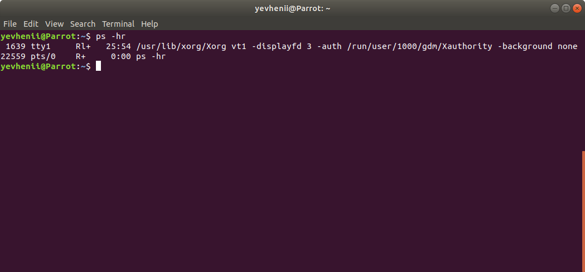
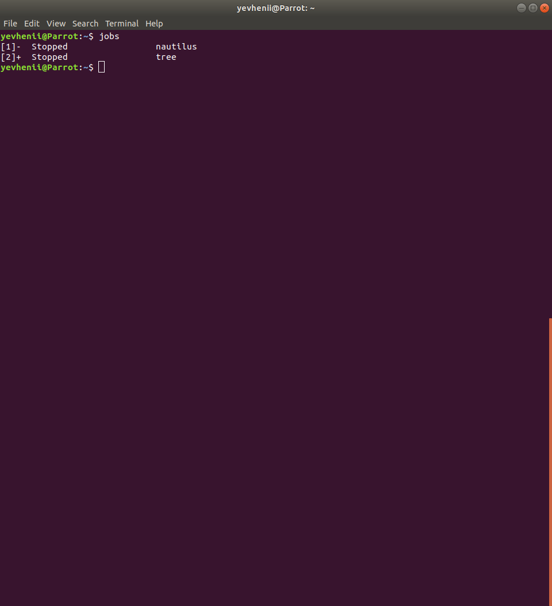
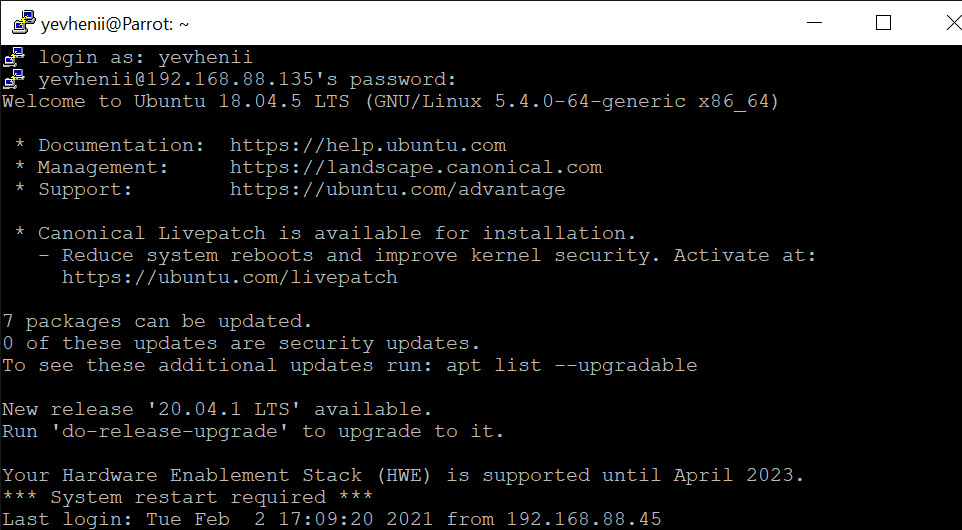
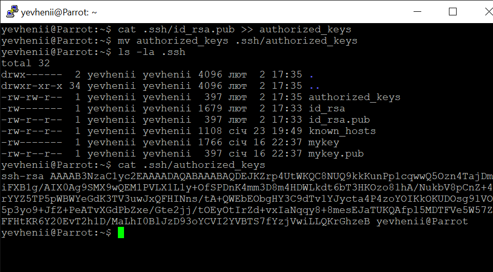
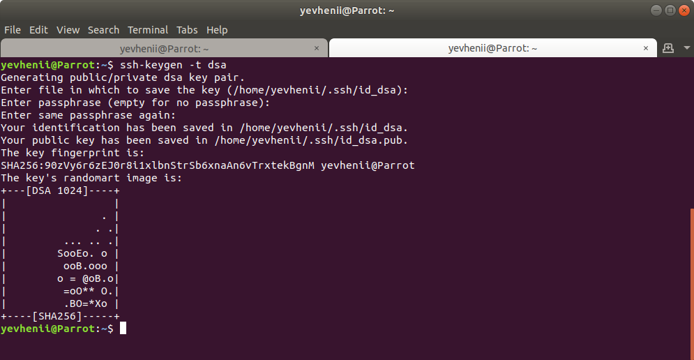

### Module 5 Linux Essentials
#### TASK 5.3 Part 1

1. How many states could has a process in Linux?

Depending on various circumstances, the state of the process during operation may change. In Linux, a process can be in the following states:

		Running: This is a state where a process is either in running or ready to run.
		
		Interruptible: This state is a blocked state of a process which awaits for an event or a signal from another process
		
		Uninterruptible: It is also a blocked state. The process is forced to halt for certain condition that a hardware status is waited and a signal could not be handled.

		Stopped: Once the process is completed, this state occurs. This process can be restarted

		Zombie: In this state, the process will be terminated and the information will still be available in the process table.
		
2. Examine the pstree command. Make output (highlight) the chain (ancestors) of the current process.

The pstree command is similar to ps , but instead of listing the running processes, it shows them in a tree. The tree-like format is a more convenient way to display the processes hierarchy and makes the output more visually appealing.

The general syntax for the pstree command:

		$ pstree [OPTIONS] [USER OR PID]

 
 
 The top item in the tree is the parent process for all system processes. In this case, it is *systemd*, the first process to start at boot.
*pstree* concatenates identical branches by enclosing them in square brackets and preceding them with an integer representing the number of branches. 

The -t option show the full threads names. If we want to hide threads and show only processes use the -T option.

 
 
 The -p option instructs pstree to show the PIDs:
 
 
 
 The -n option tells pstree to use numeric sort, i.e. sort by PIDs:
 
 
 
 The process group ID or PGIDs is the process ID of the first member of the process group. To view PGIDs use the -g option:
 
  
 
 To view how the process was started, use the command together with the -a option:
 
  
 
 *pstree* also allows you to highlight processes for better visual representation.
The -h option instructs pstree to highlight the current process and all its ancestors.

  
 
 For example, the Teams process, PID 3179:
 
  
 
 3. What is a proc file system?
 
 Proc file system (procfs) is virtual file system created on fly when system boots and is dissolved at time of system shut down.

It contains the useful information about the processes that are currently running, it is regarded as control and information centre for kernel.

The *proc* file system also provides communication medium between kernel space and user space.

To display information about processes using the *proc* command, enter the command:

		$ ls /proc
		
  
 
 When using the -l switch in the ls command, processes are highlighted in different colors.
 
   
 
		Blue – The blue part of the output represents sub-directories.
		
		White – The files that are uncolored are normal files containing data.
		
		Cyan – The cyan colored files are symbolic links.
		
Given the PID of a process, you can view its contents with the *ls /proc/PID* command.

 

View the status using the *cat /proc/PID/status* command.

 
 
 4. Print information about the processor (its type, supported technologies, etc.).
 
 The easiest way to do this is to display the contents of the virtual */proc/cpuinfo* file.
 
 		$ less /proc/cpuinfo
 
  
 
 Or use the *lscpu* command:
 
  
 
 5. Use the ps command to get information about the process.
 
 *ps -aux* command displays a detailed list of processes by user, PID, etc.
 
  
 
 Displaying process tree by user *yevhenii*:
 
   
  
  
 6. How to define kernel processes and user processes?
 
 Kernel processes are simply parts of the kernel itself, functions of common kernel code that run in the same address space and with the same privileges as the rest of the kernel code. Unlike other parts of the kernel, separate entries are created for them in the process table. They are made by processes so that their execution occurs independently of the rest of the kernel, with a lower priority. Their execution takes place under the control of the scheduler, like all other processes in the system.
 
 The linux kernel processes are started by the kernel itself, with the kthreadd process assigned as the parent process, with PID = 2. Thus, the kernel processes must be considered the process itself with PID = 2, as well as processes whose PPID is 2.
 
   
  
  7. Print the list of processes to the terminal. Briefly describe the statuses of the processes. What condition are they in, or can they be arriving in?
  
  To print the list of processes to the terminal, you can use the *ps -aux* command and view the statuses in the "STAT" column.
  
  
  
  Or use the *top* command and view the statuses in the "S" column.
  
  
  
##### Process state: Running
  
The most healthy state of all. It indicates the process is active and serving its requests. The process is properly getting system resources (especially CPU) to perform its operations. Running process is a process which is being served by CPU currently. It can be identified by state flag *R*.

The runnable state is when the process has got all the system resources to perform its operation except CPU. This means the process is ready to go once the CPU is free. Runnable processes are also flagged with state flag *R*.

##### Process state: Sleeping

The sleeping process is the one who waits for resources to run. Since its on the waiting stand, it gives up CPU and goes to sleep mode. Once its required resource is free, it gets placed in the scheduler queue for CPU to execute. There are two types of sleep modes: Interruptible and Uninterruptible

##### Interruptible sleep mode

This mode process waits for a particular time slot or a specific event to occur. If those conditions occur, the process will come out of sleep mode. These processes are shown with state *S* in ps or top output.

##### Uninterruptible sleep mode

The process in this sleep mode gets its timeout value before going to sleep. Once the timeout sets off, it awakes. Or it awakes when waited-upon resources become available for it. It can be identified by the state *D* in outputs.

##### Process state : Stopped

The process ends or terminates when they receive the kill signal or they enter exit status. At this moment, the process gives up all the occupied resources but does not release entry in the process table. Instead it sends signals about termination to its parent process. This helps the parent process to decide if a child is exited successfully or not. Once SIGCHLD received by the parent process, it takes action and releases child process entry in the process table.

##### Process state: Zombie
As explained above, while the exiting process sends SIGCHLD to parents. During the time between sending a signal to parent and then parent clearing out process slot in the process table, the process enters zombie mode. The process can stay in zombie mode if its parent died before it releases the child process’s slot in the process table. It can be identified with *Z* in outputs.

8. Display only the processes of a specific user.

The *top -fu [USER]* command allows you to display all user processes.

9. What utilities can be used to analyze existing running tasks (by analyzing the help for the ps command)?

You can use the *ps* command with the *-r* switch to display existing running tasks.

And other combinations with this key

10. What information does top command display?

*top* command is used to show the Linux processes. It provides a dynamic real-time view of the running system. Usually, this command shows the summary information of the system and the list of processes or threads which are currently managed by the Linux Kernel.
As soon as you will run this command it will open an interactive command mode where the top half portion will contain the statistics of processes and resource usage. And Lower half contains a list of the currently running processes.

##### Colums:

* PID: Shows task’s unique process id.
* PR: Stands for priority of the task.
* SHR: Represents the amount of shared memory used by a task.
* VIRT: Total virtual memory used by the task.
* USER: User name of owner of task.
* %CPU: Represents the CPU usage.
* TIME+: CPU Time, the same as ‘TIME’, but reflecting more granularity through hundredths of a second.
* SHR: Represents the Shared Memory size (kb) used by a task.
* NI: Represents a Nice Value of task. A Negative nice value implies higher priority, and positive Nice value means lower priority.
* %MEM: Shows the Memory usage of task.

##### Keys:

* -v - display the version of the program;
* -b - mode only for data output, the program does not accept interactive commands and is executed until it is terminated manually;
* -c - display full path to executable files of commands;
* -d - information update interval;
* -H - turns on the output of process streams;
* -i - do not display processes that do not use processor resources;
* -n - the number of data update cycles after which the program must be closed;
* -o - field to sort by;
* -O - ​​display all available fields for sorting;
* -p - monitor only processes specified by PID, you can specify multiple PIDs;
* -u - only display processes running as the specified user.

		top -u yevhenii

		top -v 
		
	
		
		top -i

11. Display the processes of the specific user using the top command.

		top -u [USER]
		
For example:

		top -u yevhenii
		

12. Display the processes of the specific user using the top command.

##### launch options:

* -v - display the version of the program;
* -b - mode only for data output, the program does not accept interactive commands and is executed until it is terminated manually;
* -c - display full path to executable files of commands;
* -d - information update interval;
* -H - turns on the output of process streams;
* -i - do not display processes that do not use processor resources;
* -n - the number of data update cycles after which the program must be closed;
* -o - field to sort by;
* -O - ​​display all available fields for sorting;
* -p - monitor only processes specified by PID, you can specify multiple PIDs;
* -u - only display processes running as the specified user.

##### Interactive commands:

* h - displays help for the utility;
* q or Esc - exit top;
* A - choice of color scheme;
* d or s - change the information update interval;
* H - display process streams;
* k - send a termination signal to the process;
* W - write the current program settings to the configuration file;
* Y - view additional information about the process, open files, ports, logs, etc.
* Z - change the color scheme;
* l - hide or display information about the average load on the system;
* m - turn off or switch the memory information display mode;
* x - highlight the column by which the sorting is performed;
* y - highlight in bold the processes that are running at the moment;
* z - switch between color and monochrome modes;
* c - switching the command output mode, the full path and only the command are available;
* F - setting fields with information about processes;
* o - filtering processes by an arbitrary condition;
* u - filtering processes by username;
* V - displaying processes in the form of a tree;
* i - switching the display mode of processes that are not currently using processor resources;
* n - the maximum number of processes to display in the program;
* L - search by word;
* <> - move the sorting field to the right and left;

		top -v 
		
	
		
		top -i

		top -H

		top -O

		top -o %CPU

13. Sort the contents of the processes window using various parameters (for example, the amount of processor time taken up, etc.)

Use key "b" and select 5 second.

Use key "u" and select root.

Sort by "CPU Time":

Use the *top* command.

Press *f* and select "TIME" options.

Use the up and down arrows to move this field to the top.

Press *Space* and "s" options for sort.

Go to the previous menu and heve the result.

14. Concept of priority, what commands are used to set priority?

The kernel stores a great deal of information about processes including process priority which is simply the scheduling priority attached to a process. Processes with a higher priority will be executed before those with a lower priority, while processes with the same priority are scheduled one after the next, repeatedly.

There are a total of 140 priorities and two distinct priority ranges implemented in Linux. The first one is a nice value (niceness) which ranges from -20 (highest priority value) to 19 (lowest priority value) and the default is 0, this is what we will uncover in this guide. The other is the real-time priority, which ranges from 1 to 99 by default, then 100 to 139 are meant for user-space.

To see the nice values of processes, we can use utilities such as *ps*, *top*.

To view processes nice value with ps command in user-defined format (here the NI the column shows the niceness of processes).

		$ ps -eo pid,ppid,ni,comm

or 

		$ top
		
	

- NI – is the nice value, which is a user-space concept;

- PR – is the process’s actual priority, as seen by the Linux kernel.

Calculate PR Values:

		Total number of priorities = 140
		Real time priority range(PR or PRI):  0 to 99 
		User space priority range: 100 to 139
		
Nice value range (NI): -20 to 19

		PR = 20 + NI
		PR = 20 + (-20 to + 19)
		PR = 20 + -20  to 20 + 19
		PR = 0 to 39 which is same as 100 to 139.
		
Given Nice Value:

		$ nice -n niceness-value [command args] 
		
OR

		$ nice -niceness-value [command args]
		
OR

		$ nice --adjustment=niceness-value [command args]
		
		
Important:

 - If no value is provided, nice sets a priority of 10 by default.
 - A command or program run without nice defaults to a priority of zero.
 - Only root can run a command or program with increased or high priority.
 - Normal users can only run a command or program with low priority.
 
 Change the Scheduling Priority of a Process for example:

 		$ renice -n  -12  -p 3562
 		
 
 		
		$ renice +5 -u yevhenii -p 3562

 
 
 		$ renice +12 -p 3562

 
 
15. Can I change the priority of a process using the top command? If so, how?

Type the command and choose the process:

		$ sudo top

Press *r* and typing process`s PID:

Typing the priority value:

Have a result:

16. Examine the kill command. How to send with the kill command process control signal? Give an example of commonly used signals.

*kill* command in Linux (located in /bin/kill), is a built-in command which is used to terminate processes manually. *kill* command sends a signal to a process which terminates the process. If the user doesn’t specify any signal which is to be sent along with kill command then default TERM signal is sent that terminates the process.

To display all the available signals you can use command option:

		$ kill -l
		
#### Signals can be specified in three ways:

- By number (e.g. -5)
- With SIG prefix (e.g. -SIGkill)
- Without SIG prefix (e.g. -kill)

##### Note:

- Negative PID values are used to indicate the process group ID. If you pass a process group ID then all the process within that group will receive the signal.
- A PID of -1 is very special as it indicates all the processes except kill and init, which is the parent process of all processes on the system.

##### Syntax:

- Terminate process(es):

		$ kill pid 
		
- Send a signal to process(es):

		$ kill {-signal | -s signal} pid 

- List available signals:

		$ kill {-l | --list[=signal] | -L | --table}

##### Related commands

- fuser — Identify processes using files or sockets.
- killall — Kill processes by name.
- ps — List information about running processes.

17. Commands jobs, fg, bg, nohup. What are they for? Use the sleep, yes command to demonstrate the process control mechanism with fg, bg.

##### bg command

The processes that have been stopped by some interrupt signal can be continued in the background with bg command.
The "nautilus" and "tree" process has been stopped with ctrl+z interrupt signal.

The stopped processes can be checked with *jobs* command.

You can see that the status of the jobs is stopped. The plus sign (+) indicates the current job. Minus sign (-) refers to the previous job. Now, to run the stopped job in the background, we use *bg* command. By default, if no argument is given, *bg* runs the current job in the background.

The *bg* command can take the job number as argument. The job number is indicated in the square brackets in the output of jobs.

In the above example, the job number of nautilus is 1. So now we use this job number to run the job in the background. The % sign is required for indicating the job number.

##### fg command

The *fg* command is like bg command except that instead of sending a command in the background, it runs them in the foreground and occupies the current terminal and waits for the process to exit.

Without any argument, *fg* will run the current job in the foreground.

As the command is running in the foreground, we don't get back the terminal until command exits.

Use the *sleep* command:

#### TASK 5.3 Part 2

1. Check the implementability of the most frequently used OPENSSH commands in the MS Windows operating system. (Description of the expected result of the commands +
screenshots: command – result should be presented)

After installing the OpenSSH modul for MS Windows I connected to my laptop on Ubunta using PowerShell. First establishing created a folder in the home directory on Ubuntu.

For further passwordless access to the Ubuntu operating system, I generated RSA keys and copied it to a windows device. Later I used the Putty program.

Copy RSA key to the windows machine.

Convert RSA key and use the Putty to conect to the Ubuntu machine  without password.

2. Implement basic SSH settings to increase the security of the client-server connection.

In this assignment I used Oracle VirtualBox with Ubuntu Server x64.

I chenged a SSH port to 2882.

Create RSA key.

Send public RSA key to the server machine.

Add public RSA key to the authorized_keys.

Edit /etc/ssh/sshd_config file.

 - Chenge ssh port to 2882;
 - Set PubkeyAuthentification to yes;
 - Set PasswordAuthentification to no.

3. List the options for choosing keys for encryption in SSH. Implement 3 of them.

##### Symmetrical Encryption

Symmetrical encryption is a type of encryption where one key can be used to encrypt messages to the opposite party, and also to decrypt the messages received from the other participant. This means that anyone who holds the key can encrypt and decrypt messages to anyone else holding the key.

SSH can be configured to utilize a variety of different symmetrical cipher systems, including:

- AES; 
- Blowfish; 
- 3DES; 
- CAST128;
- Arcfour.

##### Asymmetrical Encryption

Asymmetrical encryption is different from symmetrical encryption in that to send data in a single direction, two associated keys are needed. One of these keys is known as the private key, while the other is called the public key.

The public key can be freely shared with any party. It is associated with its paired key, but the private key cannot be derived from the public key. The mathematical relationship between the public key and the private key allows the public key to encrypt messages that can only be decrypted by the private key. This is a one-way ability, meaning that the public key has no ability to decrypt the messages it writes, nor can it decrypt anything the private key may send it.

For OpenSSH, you can generate keys for asymmetric encryption protocols such as:

- DSA;
- RSA;
- ECDSA;
- ED25519.

RSA, DSA, ECDSA implementation.

4. Implement port forwarding for the SSH client from the host machine to the guest Linux virtual machine behind NAT.

To the solve this task, I installed Apache2 and opened ports 80 and 443 preliminary.

5. Intercept (capture) traffic (tcpdump, wireshark) while authorizing the remote client on the server using ssh, telnet, rlogin. Analyze the result.

Using the Wireshark program, I caught the packets passing over the network between the machines.

The screenshots show that the traffic does not go through the virtual machine 192.168.88.66:80, but from the intermediary machine 192.168.88.58:80 and enters the main machine via port 8585.
