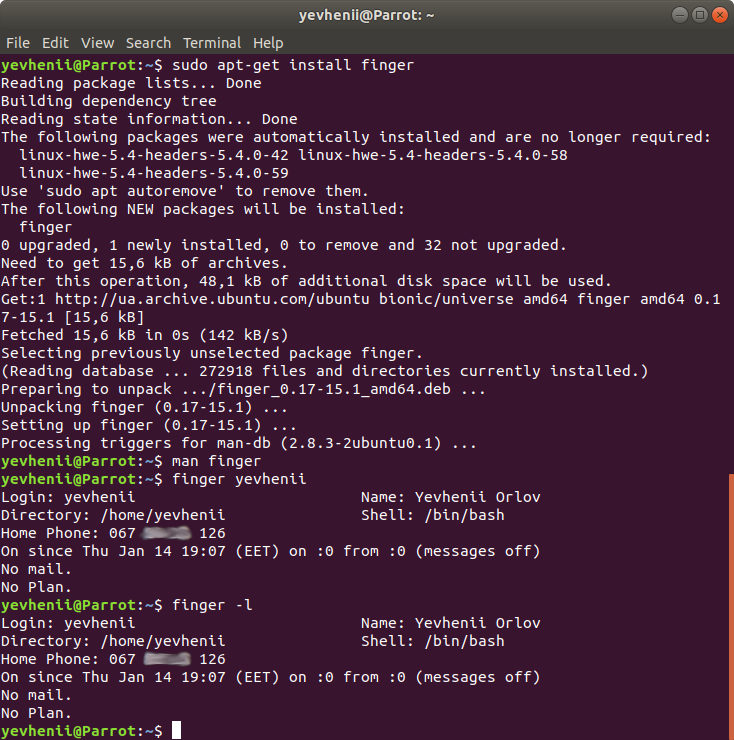

### Module 5 Linux Essentials
#### TASK 5.1 Part 1

1. Using the command 'sudo su' I connected as root user.

2. Using the command 'passwd', I managed to change the password for the root user.
After changing the password, the / etc / passwd file is changed, and the passwords are written in encrypted form to the / etc / shadow file.

 
 
 
 
 
 
 3. Using the "w" command, you can determine which users were registered in the system, the address from which the connection originated, the connection time, inactivity time, the command executed by the user, etc.
The "who" command can be used to determine the list of users logged into the system. The output contains the following columns: username, tty number, date and time, connection address.
 
 
 
 The "last" command shows the connection history for a specific user.
 
 
 
 4. Changing personal information about yourself is possible with the "chfn" command.

 
 
 5. Executing "man" and "info" commands for commands such as "chfn", "cat", "ls" and "passwd".
 
  
 
 
 
 
 
 
 
 6. Using the "man" command, I learned about the capabilities of commands such as "more" and "less".
 Using the "less" command, I scanned the .bash * file.
 
 
 
 
 
 7. Using the "finger" command, I got a certificate about the registered user.
 
  
 
 I created two files ".project" and ".plan" in my user's home directory which allowed me to describe the plan and project.
 
 
 
 8. Using the "ls" command with the "-h", "-l", "-a" keys, the contents of the home directory were displayed, displaying hidden files and directories, displaying the size and attributes.
 
 
 
 
#### TASK 5.1 Part 2

 1. Using the "tree" command and the "-P" key, it was possible to display all documents that begin with "cc".
 
  
 
 All documents ending with "cc".
 
 
 
The list subdirectories of the root directory up to and including the second nesting level.

 
 
 Only directory.
 
 
 
 2. Using the "file" command it is possible to determine the type of file.
 
  
 
 3. I navigate through the directories using the "cd" command.

  
 
 The "pushd" and "popd" commands act as a stack for working directories.
 
  