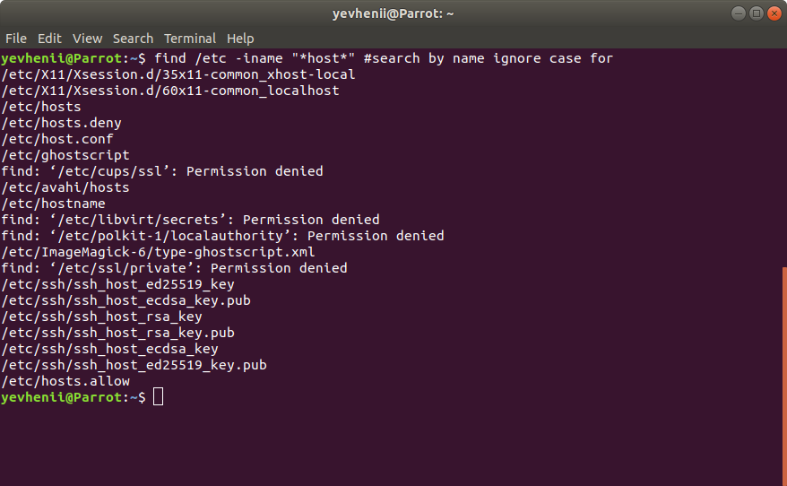

### Module 5 Linux Essentials
#### TASK 5.1 Part 1

1. Using the command 'sudo su' I connected as root user.

2. Using the command 'passwd', I managed to change the password for the root user.
After changing the password, the / etc / passwd file is changed, and the passwords are written in encrypted form to the / etc / shadow file.

 
 
 
 
 
 
 3. Using the "w" command, you can determine which users were registered in the system, the address from which the connection originated, the connection time, inactivity time, the command executed by the user, etc.
The "who" command can be used to determine the list of users logged into the system. The output contains the following columns: username, tty number, date and time, connection address.
 
 
 
 The "last" command shows the connection history for a specific user.
 
 
 
 4. Changing personal information about yourself is possible with the "chfn" command.

 
 
 5. Executing "man" and "info" commands for commands such as "chfn", "cat", "ls" and "passwd".
 
  
 
 
 
 
 
 
 
 6. Using the "man" command, I learned about the capabilities of commands such as "more" and "less".
 Using the "less" command, I scanned the .bash * file.
 
 
 
 
 
 7. Using the "finger" command, I got a certificate about the registered user.
 
  
 
 I created two files ".project" and ".plan" in my user's home directory which allowed me to describe the plan and project.
 
 
 
 8. Using the "ls" command with the "-h", "-l", "-a" keys, the contents of the home directory were displayed, displaying hidden files and directories, displaying the size and attributes.
 
 
 
 
#### TASK 5.1 Part 2

 1. Using the "tree" command and the "-P" key, it was possible to display all documents that begin with "cc".
 
  
 
 All documents ending with "cc".
 
 
 
The list subdirectories of the root directory up to and including the second nesting level.

 
 
 Only directory.
 
 
 
 2. Using the "file" command it is possible to determine the type of file.
 
  
 
 3. I navigate through the directories using the "cd" command.

  
 
 The "pushd" and "popd" commands act as a stack for working directories.
 
  
 
 4. Working with the ls command.
 
 -a - show all files, including hidden ones.
 -l - display a detailed list, which will display the owner, group, creation date, size and other parameters.
 	
 
 
 -c - sort files by modification or creation time.
 -g - show detailed information, but other than the owner of the file.
 
  
 
 -i - display inode index number
 
 
 
 -1 - display one file per line.
 
 
 
 5.1. create a subdirectory in the home directory;
 5.2 in this subdirectory create a file containing information about directories located in the root directory (using I/O redirection operations);
 
 
 
 5.3 view the created file;
 
 
 
 5.4 copy the created file to your home directory using relative and absolute addressing.
 
 
 
 5.5 delete the previously created subdirectory with the file requesting removal;
 
 
 
 5.6 delete the file copied to the home directory.
 
 
 
 6.1 create a subdirectory test in the home directory;
 
 6.2 copy the .bash_history file to this directory while changing its name to labwork2;
 
 6.3 create a hard and soft link to the labwork2 file in the test subdirectory;
 
  
 
 6.4 how to define soft and hard link, what do these
concepts;

Symbolic link attributes have the letter l. The inodes of the hard links are the same.
The symbolic link contains the address of the desired file on your file system. When someone tries to open such a link, the target file or folder is opened. The main difference between symbolic links and hard links is that when the target file is deleted, the link will remain, but it will point to nowhere, since the file actually no longer exists.

 6.5 change the data by opening a symbolic link. What changes will happen and why
 
 
 
  After the changes, the file was changed.
 
 6.6 rename the hard link file to hard_lnk_labwork2;
 
 6.7 rename the soft link file to symb_lnk_labwork2 file;
 
 
 
 6.8 then delete the labwork2. What changes have occurred and why?
 
 After removing the hard link to labwork2, the symb_lnk_labwork2 symlink is broken. Because the symb_lnk_labwork2 symlink referenced labwork2 which was removed. symlink is broken.
 
 7. Using the locate command.
 
 
 
 
 
 8. Using the command "findmnt --mtab" got a list of mounted systems.
 
 
 
The "findmnt --fstab" command displayed static information about the filesystem.

 
 
 The "findmnt --all" command lists all file systems.
 
 
 
 
 
 
 9. Count the number of lines containing a given sequence of characters in a given file.
 
 
 
 10. Using the find command, find all files in the /etc directory containing the host character sequence.
 
 
 
 11. List all objects in / etc that contain the ss character sequence. Using the "grep" command to get a similar result.
 
 
  
 
 
 12. Organize a screen-by-screen print of the contents of the /etc directory.
  
 
 
 13. On Linux, the / dev directory contains various special files. These files are called device files. Accessing devices in the Unix world is different from how it is done in other operating systems. Here this is done through a special file that is actually maintained by a driver (part of the Linux kernel) accessing the device. Another less commonly used device file type is pipe.

'fd0' First floppy drive
'fd1' Second floppy drive

'sda' First hard disk
'sdb' Second hard disk

'sda1' First partition on the first IDE hard drive
'sdb7' The tenth partition on the fourth SCSI hard drive

'sr0' First CD-ROM
'sr1' Second CD-ROM

'ttyS0' Serial port 0, COM1 under MS-DOS
'ttyS1' Serial port 1, COM2 under MS-DOS

'psaux' Device PS / 2 mouse
'gpmdata' Pseudo device, repeater from GPM daemon (mouse)

'cdrom' Symbolic link to CD-ROM drive
'mouse' Symbolic link to the mouse device file

null Anything written to this device will disappear
zero You can endlessly read zeros from this device
 
 14. The file type can be displayed with the "file" command.
 
  
 
 File types:

-Text files
-Executable files
-Image files
-Archive files
-Files of program libraries
-And other similar types

In attributes, by the first character, you can identify the following files:

-: regular file
d: directory
c: character device file
b: block device file
s: local socket file
p: named pipe
l: symbolic link
 
 15. List the first 5 directory files that were recently accessed in the /etc directory.
 
 