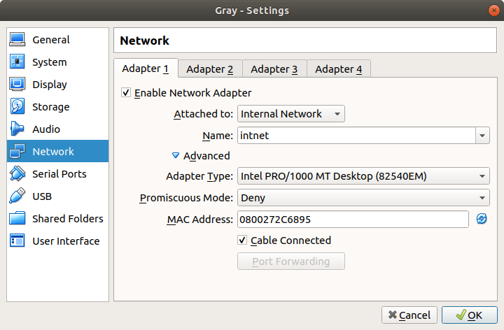

### Module 6 Networking with Linux
#### TASK 6.1

1. Create virtual machines connection according to figure 1 - Done!

  

2. VM2 has one interface (internal), VM1 has 2 interfaces (NAT and internal). Configure all network interfaces in order to make VM2 has an access to the Internet (iptables, forward, masquerade).

Virtual machine settings:

  
 
  
 
  
 
  
 
  
 
  

3. Check the route from VM2 to Host.

 

 

4. Check the access to the Internet, (just ping, for example, 8.8.8.8).

5. Determine, which resource has an IP address 8.8.8.8.

 

6. Determine, which IP address belongs to resource epam.com.

 

7. Determine the default gateway for your HOST and display routing table.

 

 

8. Trace the route to google.com.

 
