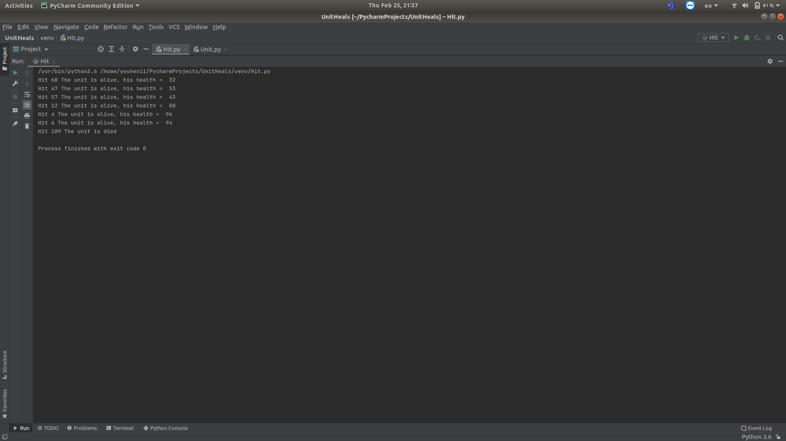

### Module 9 Python Essentials
#### TASK 9.1 

 1. The function was developed as indicated in the assignment.

 
 
 ```python
 
 def get_reply(number):
    if number%5==0 and number%3==0:
        return 'FizzBuzz'
    elif number%3==0:
        return 'Fizz'
    elif number%5==0:
        return 'Buzz'
    else:
        return ''
        
 ```
 
 - FizzBizz test developed.
 
 
 
 ```python
 
 import fizz_buzz

def test_fizz(number):
    result = fizz_buzz.get_reply(number)

    if result == "Fizz":
        print("Test Fizz     number = ", number, "Complete");
    else:
        print("Test Fizz     number = ", number, "Incomplete");


def test_buzz(number):
    result = fizz_buzz.get_reply(number)

    if result == "Buzz":
        print("Test Buzz     number = ", number, "Complete");
    else:
        print("Test Buzz     number = ", number, "Incomplete");


def test_fizzbuzz(number):
    result = fizz_buzz.get_reply(number)

    if result == "FizzBuzz":
        print("Test FizzBuzz number = ", number, "Complete");
    else:
        print("Test FizzBuzz number = ", number, "Incomplete");


for number in range(1, 101):

    test_fizz(number)

    test_buzz(number)

    test_fizzbuzz(number)


 ```
 
 - Result of test.
  
 
 
 
 
 2. The test for calculating the state of a geme unit after a hit and calculating residual health has been created.
 
- Unit health file.

 
 
 ```python
 
 def unit(number):
    if number < 100:
        return "He is alive"
    else:
        return "He is died"
 
 ```
 
- Сharacter vitality test.
 
 
 
 ```python
 
import Unit
import random

def unit(number):
    result = Unit.unit(number)

    if result == "He is alive":
        print("Hit", number, "The unit is alive, his health = ", 100 - number);
    else:
        print("Hit", number, "The unit is died");

health = 1

while health != 0:
    number = random.randint(0,120)
    unit(number)
    if number >= 100:
        health = 0;
 
 ```
 
- Result of test.
 
 
  
 3. 